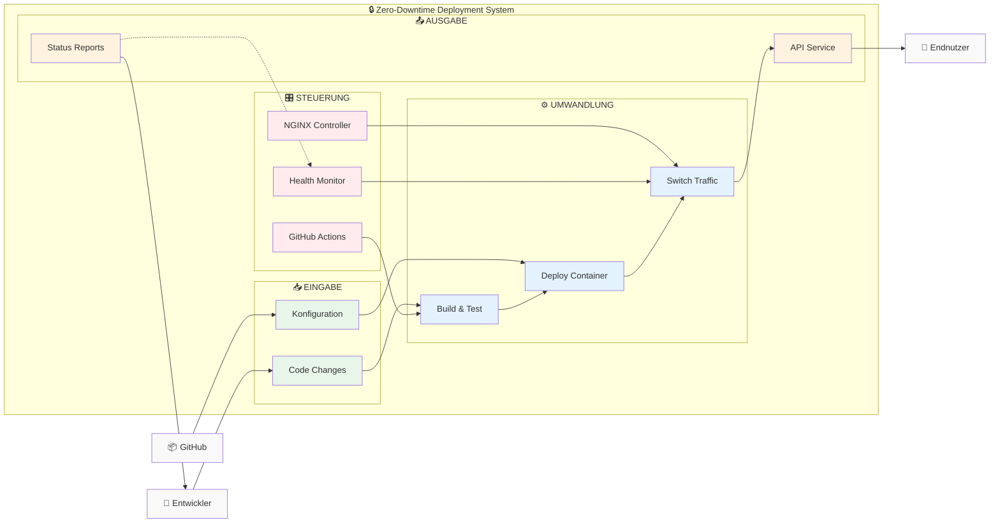
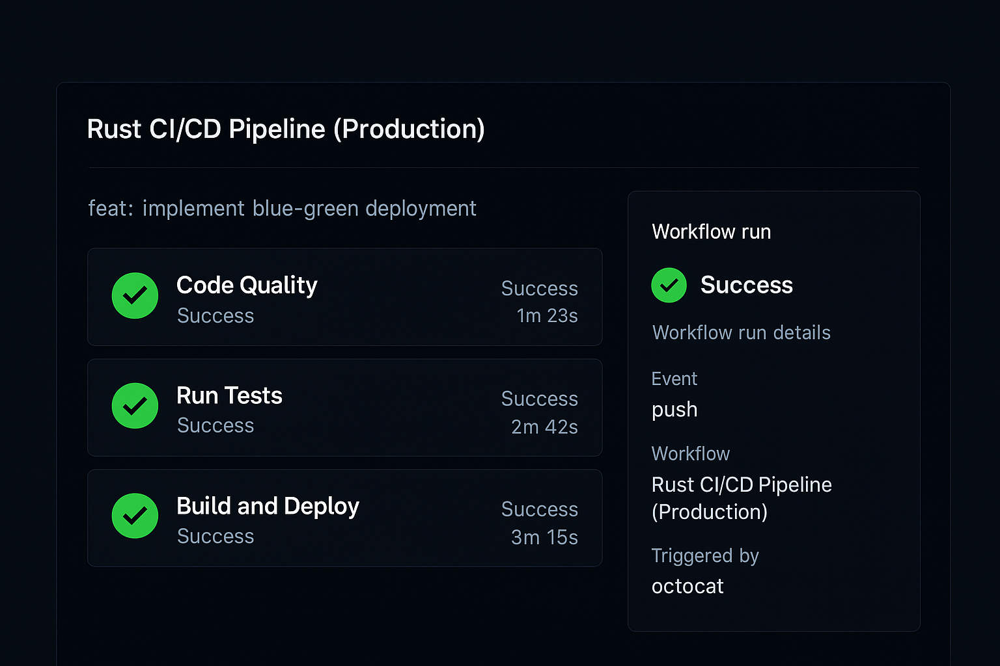

# Zero-Downtime Deployment eines Rust-basierten Blockchain-Indexers

<p align="center">
  
</p>

Dieses Projekt implementiert ein Zero-Downtime Deployment-System für  Penumbra Blockchain Explorer, der kryptographische Blockchain-Daten für Endbenutzer verständlich visualisiert. [Penumbra](https://penumbra.zone/) ist eine datenschutzorientierte Zero-Knowledge-Blockchain, deren komplexe Datenstrukturen ohne spezielle Indexierung und Aufbereitung für normale Anwender nicht lesbar wären.


## Wichtige Links

| Beschreibung | Link |
|--------------|------|
| **Doku-Repository** | [tbz-zerodowntime-deployment-project](https://github.com/JumpiiX/tbz-zerodowntime-deployment-project) |
| **Rust Blockchain Indexer** | [penumbra-explorer-backend](https://github.com/pk-labs/penumbra-explorer-backend) |
| **Scrum Board** | [GitHub Projects Board](https://github.com/users/JumpiiX/projects/2/views/1) |
| **Roadmap** | [Projekt Roadmap](https://github.com/users/JumpiiX/projects/2/views/4) |
| **Sprints** | [Milestones Übersicht](https://github.com/JumpiiX/tbz-zerodowntime-deployment-project/milestones) |

## Inhaltsverzeichnis

1. [Einführung und Problemstellung](#einführung-und-problemstellung)
2. [Projektziele](#projektziele)
3. [Projektmanagement](#projektmanagement)
4. [Sprints und Fortschritt](#sprints-und-fortschritt)
5. [Technische Dokumentation](#technische-dokumentation)
6. [Risiken](#risiken)

## Einführung und Problemstellung

### Problemstellung

Blockchain-Daten müssen kontinuierlich und zuverlässig indiziert werden, um sie in Echtzeit für Endanwender bereitzustellen – beispielsweise in einem Block Explorer. Da sich das Datenmodell oder die Indizierungslogik regelmässig ändert, müssen bestehende Indexer-Instanzen ersetzt und Daten neu aufgebaut werden (Reindexing).

Ohne geeignete Strategie führt dies zu:
- **Downtime** für Endnutzer
- **Inkonsistenten Daten** während der Umschaltung
- **Benutzerfehlern** durch unvollständige Daten

### Für wen lösen wir das Problem?

Mein aktueller Arbeitgeber [PK Labs](https://www.pklabs.me/) benötigt eine Lösung, um unsere Rust-basierten Blockchain-Indexer für die Penumbra-Blockchain ohne Unterbrechungen aktualisieren zu können. Dies betrifft sowohl:
- Interne Entwicklungsteams, die kontinuierlichen Zugriff auf Blockchain-Daten benötigen
- Externe Kunden und Nutzer, die auf die API des Indexers für ihre Anwendungen angewiesen sind
- Unseren [Penumbra Blockchain Explorer](https://explorer.penumbra.zone/) 

### Herausforderungen bei aktuellen Deployments

Die bestehenden Deployment-Prozesse bei PK Labs haben folgende Herausforderungen:

| Herausforderung | Auswirkung | Häufigkeit |
|-----------------|------------|------------|
| Downtime während Updates | Nutzer können nicht auf den Explorer zugreifen | Bei jedem Update (ca. 2x pro Woche) |
| Inkonsistente Daten | Falsche oder unvollständige Informationen werden angezeigt | Bei jedem Reindexing-Vorgang |
| Manuelle Überwachung | Entwickler müssen den Synchronisationsprozess überwachen | Dauerhaft während Updates |
| Kein automatischer Rollback | Bei Fehlern ist manuelles Eingreifen erforderlich | Bei ca. 15% der Deployments |

### Lösungsansatz: Blue-Green Deployment

Die Lösung für die genannten Herausforderungen ist ein **Blue-Green Deployment**-Konzept:

1. **Parallel-Betrieb:** Eine neue Indexer-Instanz (Green) wird parallel zur laufenden Instanz (Blue) gestartet
2. **Hintergrund-Synchronisation:** Die neue Instanz synchronisiert die Blockchain-Daten, während die alte weiter im Produktivbetrieb ist
3. **Automatische Erkennung:** Ein Monitoring-System erkennt, wann die neue Instanz vollständig synchronisiert ist
4. **Nahtlose Umschaltung:** Ein NGINX Reverse Proxy leitet den Traffic ohne Unterbrechung zur neuen Instanz um
5. **Fallback-Option:** Bei Problemen kann sofort zur alten Instanz zurückgeschaltet werden

#### Komponenten der Lösung

| Komponente | Zweck | Technologie |
|------------|-------|-------------|
| **NGINX Reverse Proxy** | Traffic-Steuerung zwischen Umgebungen | NGINX mit dynamischer Konfiguration |
| **Docker Container** | Isolierte Umgebungen für den Indexer | Docker, Docker Compose |
| **Monitoring-Script** | Überwachung des Synchronisationsstatus | Shell-Script mit Docker-Abfragen |
| **Switch-Mechanismus** | Automatisierte Umschaltung | Shell-Script zur NGINX-Konfiguration |
| **Rollback-Mechanismus** | Sichere Rückkehr zur vorherigen Version | Automatisiertes Script mit Datenbank-Checks |

#### Visualisierung


*Abbildung: Visualisierung des Zero-Downtime Deployment-Prozesses mit Blue-Green Strategie vom Code-Push bis zum Traffic-Switch*

### Projektvisualisierungen

#### SEUSAG-Diagramm


## Projektziele

Die Ziele dieses Projekts sind nach dem SMART-Prinzip definiert:

### 1. Eliminierung von Deployment-bedingten Downtimes
- **Spezifisch:** Implementierung eines Blue-Green Deployment-Systems, das Updates ohne Ausfallzeit ermöglicht
- **Messbar:** Reduzierung der Downtime von derzeit durchschnittlich 15 Minuten pro Deployment auf 0 Sekunden
- **Attraktiv:** Erhöhte Verfügbarkeit des Blockchain-Explorers (Ziel: 99,9%)
- **Realistisch:** Umsetzbar mit NGINX, Docker und automatisierten Scripts
- **Terminiert:** Vollständig implementiert bis 09.07.2025

### 2. Automatisierung der Deployment-Pipeline
- **Spezifisch:** Entwicklung einer vollautomatischen Deployment-Pipeline vom Code bis zur Produktion
- **Messbar:** Reduzierung des manuellen Aufwands pro Deployment von 45 auf unter 5 Minuten
- **Attraktiv:** Geringere Fehleranfälligkeit und höhere Entwicklereffizienz
- **Realistisch:** Umsetzbar mit Shell-Scripts und Docker Compose
- **Terminiert:** Fertigstellung bis Ende Sprint 2 (02.06.2025)

### 3. Implementierung einer zuverlässigen Synchronisationserkennung
- **Spezifisch:** Entwicklung eines Monitoring-Systems zur Erkennung des Indexer-Synchronisationsstatus
- **Messbar:** 100% zuverlässige Erkennung mit einer Fehlertoleranz von maximal 0,1%
- **Attraktiv:** Vermeidung von Dateninkonsistenzen und falschen Umschaltungen
- **Realistisch:** Implementierbar mit API-Abfragen und intelligenten Vergleichsalgorithmen
- **Terminiert:** Abschluss bis Mitte Sprint 3 (15.06.2025)

## Projektmanagement

### Agile Arbeitsweise mit Scrum

Für dieses Projekt wird **Scrum** als agile Methodik verwendet aus folgenden Gründen:

1. **Iterative Entwicklung:** Die komplexe Natur des Blue-Green Deployments erfordert einen schrittweisen Ansatz, bei dem Komponenten einzeln entwickelt und getestet werden können.

2. **Regelmässiges Feedback:** Durch Sprint Reviews mit den Dozenten kann frühzeitig wertvolles Feedback eingeholt und in die weitere Entwicklung einbezogen werden.

3. **Transparente Fortschrittsverfolgung:** Das Scrum-Board bietet jederzeit einen klaren Überblick über den aktuellen Projektstand und offene Tasks.

4. **Flexibilität:** Neue Erkenntnisse oder sich ändernde Anforderungen können schnell in die Projektplanung integriert werden.

#### Anpassungen für Einzelprojekt

Da es sich um ein Einzelprojekt handelt, wurden folgende Anpassungen am klassischen Scrum-Prozess vorgenommen:

| Scrum-Element | Klassische Umsetzung | Anpassung für Einzelprojekt |
|---------------|----------------------|----------------------------|
| **Daily Standup** | Tägliches Team-Meeting | Tägliche Selbstreflexion und Fortschrittsdokumentation |
| **Sprint Planning** | Team-Entscheidung | Abstimmung mit Dozenten und eigenständige Planung |
| **Peer Reviews** | Team-interne Reviews | Dozentenfeedback und Selbstreview anhand von Checklisten |
| **Product Owner** | Dedizierte Rolle | Rolle wird durch Dozenten und selbst übernommen |
| **Scrum Master** | Dedizierte Rolle | Selbstorganisation mit regelmässiger Prozessreflexion |

### Definition of Done

Ein Task gilt als abgeschlossen, wenn:

1. Die Implementierung vollständig ist und alle Akzeptanzkriterien erfüllt sind
2. Eine umfassende Dokumentation erstellt wurde
3. Tests durchgeführt und dokumentiert wurden (mit Testprotokoll)
4. Der Code/die Änderung ist ins Repository eingecheckt

## Sprints und Fortschritt

### Sprint 1: Projektsetup und Grundlagen (14.04 - 09.05)

#### Sprint 1 Planung

Die Planung für Sprint 1 wurde am 14.04.2025 durchgeführt und folgende Ziele und Tasks wurden definiert:

**Sprint-Ziel:** Einrichtung der Projektgrundlagen und Dokumentation der Ausgangslage für das Zero-Downtime Deployment-System.


Die Planung wurde mit Corrado und Boris (Projektexperte) abgestimmt, und am 17.04.2025 erhielt ich das endgültige "Go" für mein Projekt.

#### Sprint 1 Durchführung und Ergebnisse

Während Sprint 1 wurden folgende Ergebnisse erzielt:

- **GitHub Repository** eingerichtet mit grundlegender Dokumentationsstruktur
- **GitHub Projects Board** als Scrum-Board konfiguriert mit User Stories und Akzeptanzkriterien
- **Ausführliche Dokumentation** der Problemstellung, des Lösungsansatzes und der SMART-Ziele im README
- **Klare Begründung** für die Wahl von Scrum als agile Methodik und notwendige Anpassungen dokumentiert
- **Visualisierung** des Zero-Downtime Deployment-Prozesses mittels Diagramm
- **Definition of Done** etabliert und dokumentiert
- **Sprint 2 Planung** mit konkreten Tasks vorbereitet

#### Sprint 1 Review (09.05.2025)

Der Sprint 1 Review wurde am 09.05.2025 mit Corrado Parisi durchgeführt:

**Agenda:**
1. Projektstand
2. Erledigte Tasks
3. Herausforderungen 
4. Demo: Repository & Diagramm
5. Sprint 2 Planung
6. Fragen & Feedback

**Präsentierte Ergebnisse:**
- Vollständiges README mit Problemstellung, Lösungsansatz und SMART-Zielen
- GitHub Repository mit Strukturierung und Dokumentation
- GitHub Projects Board mit User Stories und Akzeptanzkriterien

**Feedback:**
- Corrado Parisi hob die Wahl eines anspruchsvollen Projekts positiv hervor
- Er lobte die gut definierten Akzeptanzkriterien und die Qualität der SMART-Ziele

**Vereinbarte Anpassungen:**
- Erstellung eines Gantt-Charts für die Projektplanung
- Entwicklung eines SEUSAG-Diagramms zur Visualisierung der Systemkomponenten
- Standardisierung des User Story-Formats nach dem Schema "Als [Rolle] möchte ich [Funktionalität], damit [Nutzen]"

**Reflexion:**
Die Dokumentation der Problemstellung und des Lösungsansatzes war erfolgreich. Die User Stories mit ihren detaillierten Akzeptanzkriterien wurden besonders positiv bewertet. Die Entwicklung eines klaren Deployment-Flow-Diagramms nahm mehr Zeit in Anspruch als geplant, wurde aber mit gutem Ergebnis abgeschlossen. Die Anpassung von Scrum für ein Einzelprojekt stellte eine Herausforderung dar, wurde aber durch die dokumentierten Anpassungen gut gelöst.

### Sprint 2: Server-Infrastruktur (10.05 - 02.06)

#### Sprint 2 Planung

Nach dem erfolgreichen Sprint 1 Review war ich richtig motiviert, endlich mit der technischen Umsetzung zu beginnen. Corrado hatte mir wertvolles Feedback gegeben, und jetzt ging es darum, die Theorie in die Praxis umzusetzen.

**Sprint-Ziel:** Eine funktionierende Production-Umgebung aufbauen, in der unser Penumbra Blockchain Indexer zuverlässig läuft - mit automatischem Deployment und allem Drum und Dran.

**Was ich mir für Sprint 2 vorgenommen hatte:**

##### 1. Ubuntu Server Setup (3 Story Points)
- **Als** Software Engineer **möchte ich** einen Ubuntu-Server in der Hetzner Cloud einrichten, **damit** ich eine stabile und leistungsfähige Umgebung für den Blockchain-Indexer bereitstellen kann.
- *Das war der erste wichtige Schritt - ohne Server läuft nichts!*

##### 2. Docker Installation (2 Story Points)
- **Als** Software Engineer **möchte ich** Docker und Docker Compose auf dem Server installieren und konfigurieren, **damit** ich containerisierte Anwendungen für den Blockchain-Indexer bereitstellen kann.
- *Docker macht das Leben so viel einfacher...*

##### 3. NGINX Reverse Proxy (5 Story Points)
- **Als** Software Engineer **möchte ich** NGINX als Reverse Proxy einrichten, **damit** ich eine zentrale Stelle für die Verkehrsweiterleitung zum Docker Container habe.
- *Der Klassiker für Production-Setups!*

##### 4. TLS/SSL Implementierung (3 Story Points)
- **Als** Software Engineer **möchte ich** TLS/SSL mit Let's Encrypt implementieren, **damit** die Kommunikation zwischen Clients und dem Backend-Service verschlüsselt und sicher ist.
- *Sicherheit first - niemand will unverschlüsselte APIs!*

##### 5. CI/CD Pipeline (5 Story Points)
- **Als** Software Engineer **möchte ich** einen GitHub Workflow für Continuous Integration und Deployment einrichten, **damit** Code-Änderungen automatisch getestet, gebaut und auf dem Server bereitgestellt werden.
- *Automatisierung ist der Schlüssel zu meiner Sanity...*

##### 6. Dokumentation (3 Story Points)
- **Als** Software Engineer **möchte ich** die Server-Infrastruktur und alle Konfigurationen umfassend dokumentieren, **damit** die Umgebung leicht nachvollziehbar, wartbar und bei Bedarf reproduzierbar ist.
- *Future-Me wird mir danken!*

**Geplante Velocity:** 21 Story Points - sportlich, aber machbar!

---

#### Sprint 2 - So lief es wirklich

##### 🖥️ Ubuntu Server Setup - Der Anfang von allem
**Status:** ✅ Done!

Ich hab mir einen schicken Hetzner Cloud Server geklickt - Ubuntu 24.04 LTS, weil ich auf Nummer sicher gehen wollte. Die Specs:

```bash
# Mein neues Zuhause für den Indexer
OS: Ubuntu 24.04 LTS (die gute alte LTS!)
CPU: 2 vCPU (sollte reichen)
RAM: 4 GB (Rust ist ja memory-efficient)
Storage: 40 GB NVMe SSD (schnell muss es sein)
Location: Nürnberg (für die niedrige Latenz)
```

Das Setup war straightforward, aber ich hab natürlich direkt die Firewall vergessen und mich fast ausgesperrt. Zum Glück hatte ich noch eine Console-Session offen!

**Was ich gemacht hab:**

```bash
# SSH-Key kopieren (sicherer als Passwörter!)
ssh-copy-id -i ~/.ssh/id_rsa.pub root@server-ip

# System updaten
apt update && apt upgrade -y

# Basis-Packages installieren
apt install -y curl wget git build-essential htop vim

# Firewall einrichten (diesmal richtig!)
ufw allow 22/tcp    # SSH
ufw allow 80/tcp    # HTTP
ufw allow 443/tcp   # HTTPS
ufw enable

# Zeitzone setzen
timedatectl set-timezone Europe/Zurich
```

**Learning:** Immer erst die Firewall-Regeln testen, BEVOR man sie aktiviert...


*Terminal-Screenshot nach erfolgreichem Setup*

---

##### 🐳 Docker - Container sind Leben
**Status:** ✅ Geschafft!

Docker Installation war ein Kinderspiel - die Docs von Docker sind echt gut. Hab die neueste Version installiert und direkt ein eigenes Netzwerk für unseren Indexer erstellt:

```bash
# Docker GPG Key hinzufügen
curl -fsSL https://download.docker.com/linux/ubuntu/gpg | sudo gpg --dearmor -o /usr/share/keyrings/docker-archive-keyring.gpg

# Docker Repository hinzufügen
echo "deb [arch=$(dpkg --print-architecture) signed-by=/usr/share/keyrings/docker-archive-keyring.gpg] https://download.docker.com/linux/ubuntu $(lsb_release -cs) stable" | sudo tee /etc/apt/sources.list.d/docker.list > /dev/null

# Docker installieren
apt update
apt install -y docker-ce docker-ce-cli containerd.io docker-compose-plugin

# Das Netzwerk für unseren Penumbra Explorer
docker network create penumbra-prod-net

# Deploy-User einrichten (Security first!)
sudo useradd -m -s /bin/bash deploy-penumbra-explorer
sudo usermod -aG docker deploy-penumbra-explorer
```

Der Deploy-User war wichtig - ich wollte nicht, dass GitHub Actions als root läuft. Das wäre echt keine gute Idee gewesen.

**Test-Moment:** 
```bash
docker run hello-world
```
Das befriedigendste "Hello from Docker!" ever! 🎉

---

##### 🔀 NGINX - Der Traffic-Dirigent
**Status:** ✅ Läuft wie geschmiert!

NGINX einzurichten war... interessant. Ich hab bestimmt drei Mal die Konfiguration verkackt, bis ich gemerkt hab, dass ich den symbolischen Link vergessen hatte. Classic!

```bash
# NGINX installieren
apt install -y nginx

# Konfiguration erstellen
vim /etc/nginx/sites-available/penumbra-explorer
```

```nginx
# /etc/nginx/sites-available/penumbra-explorer
server {
    listen 80;
    server_name explorer.example.com;  # Keine echte Domain hier ;)
    
    # Hauptroute zum Indexer
    location / {
        proxy_pass http://localhost:8080;
        proxy_set_header Host $host;
        proxy_set_header X-Real-IP $remote_addr;
        proxy_set_header X-Forwarded-For $proxy_add_x_forwarded_for;
        proxy_set_header X-Forwarded-Proto $scheme;
        
        # WebSocket support - wichtig für Live-Updates!
        proxy_http_version 1.1;
        proxy_set_header Upgrade $http_upgrade;
        proxy_set_header Connection "upgrade";
        
        # Timeouts für lange Blockchain-Queries
        proxy_read_timeout 300s;
        proxy_connect_timeout 75s;
    }
    
    # Health-Check Endpoint
    location /health {
        proxy_pass http://localhost:8080/health;
        access_log off;  # Spam vermeiden
    }
}
```

```bash
# Konfiguration aktivieren
ln -s /etc/nginx/sites-available/penumbra-explorer /etc/nginx/sites-enabled/

# Config testen (Life saver!)
nginx -t

# NGINX neustarten
systemctl restart nginx
```

**Pro-Tipp:** `nginx -t` ist dein bester Freund! Testet die Config ohne den Service zu killen.

---

##### 🔒 SSL/TLS - Grünes Schloss für alle!
**Status:** ✅ Sicher und verschlüsselt!

Let's Encrypt ist einfach genial - kostenloses SSL für alle! Certbot macht den ganzen Prozess super easy:

```bash
# Certbot installieren
apt install -y certbot python3-certbot-nginx

# Magic happens here
certbot --nginx -d explorer.example.com --non-interactive --agree-tos -m admin@example.com
```

Die automatisch generierte SSL-Config von Certbot war okay, aber ich hab sie noch etwas getunt:

```nginx
# Erweiterte SSL-Konfiguration
server {
    listen 443 ssl http2;
    server_name explorer.example.com;
    
    # Certbot managed
    ssl_certificate /etc/letsencrypt/live/explorer.example.com/fullchain.pem;
    ssl_certificate_key /etc/letsencrypt/live/explorer.example.com/privkey.pem;
    
    # Mozilla Intermediate Config - der Sweet Spot
    ssl_protocols TLSv1.2 TLSv1.3;
    ssl_ciphers ECDHE-ECDSA-AES128-GCM-SHA256:ECDHE-RSA-AES128-GCM-SHA256:ECDHE-ECDSA-AES256-GCM-SHA384:ECDHE-RSA-AES256-GCM-SHA384;
    ssl_prefer_server_ciphers off;
    
    # HSTS - einmal HTTPS, immer HTTPS!
    add_header Strict-Transport-Security "max-age=63072000" always;
    
    # Security Headers
    add_header X-Frame-Options "SAMEORIGIN" always;
    add_header X-Content-Type-Options "nosniff" always;
    add_header X-XSS-Protection "1; mode=block" always;
    
    # Rest der Config...
    location / {
        proxy_pass http://localhost:8080;
        # ... proxy settings ...
    }
}

# HTTP zu HTTPS Redirect
server {
    listen 80;
    server_name explorer.example.com;
    return 301 https://$server_name$request_uri;
}
```

**Achievement unlocked:** SSL Labs Test mit A-Rating! 🎉


*SSL Labs gibt uns ein solides A - Mission accomplished!*

---

##### 🚀 CI/CD Pipeline - Automatisierung FTW!
**Status:** ✅ Deployment auf Knopfdruck!

Die GitHub Actions Pipeline war mein Baby in diesem Sprint. Nach etlichen Iterationen (und vielen failed Builds) hab ich endlich eine Pipeline, die rockt:

```yaml
# .github/workflows/deploy-prod.yml
name: Rust CI/CD Pipeline (Production)

on:
  push:
    branches: [main]
  workflow_dispatch:  # Manuelles Triggern ist nice to have

env:
  APP_NAME: penumbra-explorer
  SERVER_USER: deploy-penumbra-explorer
  SERVER_HOST: ${{ secrets.SERVER_HOST_PROD }}
  RUST_VERSION: 1.83.0

jobs:
  code-quality:
    name: Code Quality
    runs-on: ubuntu-latest
    steps:
      - name: Checkout repository
        uses: actions/checkout@v4
      
      - name: Install Rust toolchain
        uses: dtolnay/rust-toolchain@stable
        with:
          toolchain: ${{ env.RUST_VERSION }}
          components: rustfmt, clippy
      
      - name: Cache dependencies
        uses: Swatinem/rust-cache@v2
        with:
          key: ${{ runner.os }}-cargo-${{ hashFiles('**/Cargo.lock') }}
      
      - name: Check formatting
        run: cargo fmt --all -- --check
      
      - name: Run clippy
        run: cargo clippy --all-targets --all-features -- -D warnings

  test:
    name: Run Tests
    runs-on: ubuntu-latest
    needs: code-quality
    steps:
      - name: Checkout repository
        uses: actions/checkout@v4
      
      - name: Install Rust toolchain
        uses: dtolnay/rust-toolchain@stable
        with:
          toolchain: ${{ env.RUST_VERSION }}
      
      - name: Cache dependencies
        uses: Swatinem/rust-cache@v2
      
      - name: Run tests
        run: |
          cargo test --all --verbose
          cargo test --all --release

  build-and-deploy:
    name: Build and Deploy
    runs-on: ubuntu-latest
    needs: [code-quality, test]
    if: github.ref == 'refs/heads/main'
    
    steps:
      - name: Checkout code
        uses: actions/checkout@v4
      
      - name: Set up Docker Buildx
        uses: docker/setup-buildx-action@v3
      
      - name: Build Docker image
        uses: docker/build-push-action@v5
        with:
          context: .
          push: false
          tags: ${{ env.APP_NAME }}:latest,${{ env.APP_NAME }}:${{ github.sha }}
          outputs: type=docker,dest=/tmp/${{ env.APP_NAME }}.tar
          cache-from: type=gha
          cache-to: type=gha,mode=max
          build-args: |
            RUST_VERSION=${{ env.RUST_VERSION }}
      
      - name: Deploy to server
        uses: appleboy/ssh-action@v1.0.0
        with:
          host: ${{ env.SERVER_HOST }}
          username: ${{ env.SERVER_USER }}
          key: ${{ secrets.DEPLOY_SSH_KEY }}
          script: |
            # Backup current version
            docker tag ${{ env.APP_NAME }}:latest ${{ env.APP_NAME }}:backup || true
            
            # Load new image
            docker load -i /tmp/${{ env.APP_NAME }}.tar
            
            # Stop old container gracefully
            docker stop -t 30 ${{ env.APP_NAME }} || true
            docker rm ${{ env.APP_NAME }} || true
            
            # Run new container
            docker run -d \
              --name ${{ env.APP_NAME }} \
              --network penumbra-prod-net \
              -p 8080:8080 \
              -e RUST_LOG=info \
              -e SOURCE_DB_URL="${{ secrets.SOURCE_DB_URL }}" \
              -e DEST_DB_URL="${{ secrets.DEST_DB_URL }}" \
              -v /home/${{ env.SERVER_USER }}/data:/app/data \
              --restart unless-stopped \
              --health-cmd="curl -f http://localhost:8080/health || exit 1" \
              --health-interval=30s \
              --health-timeout=10s \
              --health-retries=3 \
              ${{ env.APP_NAME }}:latest
            
            # Wait for health check
            sleep 10
            
            # Verify deployment
            if curl -f http://localhost:8080/health; then
              echo "✅ Deployment successful!"
              docker rmi ${{ env.APP_NAME }}:backup || true
            else
              echo "❌ Deployment failed, rolling back..."
              docker stop ${{ env.APP_NAME }} || true
              docker rm ${{ env.APP_NAME }} || true
              docker tag ${{ env.APP_NAME }}:backup ${{ env.APP_NAME }}:latest
              exit 1
            fi
```

Das Highlight: Multi-stage Docker Builds! Von 1.2GB auf 80MB runter - das nenn ich Optimierung!

```dockerfile
# Multi-stage Dockerfile für optimale Grösse
FROM rust:1.83-slim AS builder

# Build dependencies installieren
RUN apt-get update && apt-get install -y \
    pkg-config \
    libssl-dev \
    && rm -rf /var/lib/apt/lists/*

WORKDIR /app

# Dependencies cachen
COPY Cargo.toml Cargo.lock ./
RUN mkdir src && echo "fn main() {}" > src/main.rs
RUN cargo build --release && rm -rf src

# Source code kopieren und bauen
COPY . .
RUN touch src/main.rs && cargo build --release

# Runtime image
FROM debian:bookworm-slim

RUN apt-get update && apt-get install -y \
    ca-certificates \
    libssl3 \
    curl \
    && rm -rf /var/lib/apt/lists/*

WORKDIR /app

# Binary kopieren
COPY --from=builder /app/target/release/penumbra-explorer /app/

# User für Security
RUN useradd -m -u 1001 -U appuser && chown -R appuser:appuser /app
USER appuser

EXPOSE 8080

CMD ["./penumbra-explorer"]
```

**Stolzer Moment:** Der erste automatische Deploy nach einem Push - es hat einfach funktioniert! 🚀

---

##### 📚 Dokumentation - Für Future-Me
**Status:** ✅ Alles dokumentiert!

Ich hab wirklich versucht, alles zu dokumentieren. Jeder Schritt, jede Konfiguration, jedes "Warum". Die README ist jetzt ein kleines Buch geworden, aber hey - besser zu viel als zu wenig!

**Was ich dokumentiert hab:**
- ✓ Komplette Server-Setup-Anleitung (mit allen Befehlen)
- ✓ Docker & NGINX Configs mit Kommentaren
- ✓ Troubleshooting-Guide (aus eigenen Fehlern gelernt)
- ✓ Secrets Management (wie man es RICHTIG macht)
- ✓ Deployment-Prozess Schritt für Schritt
- ✓ Rollback-Strategie

---

#### Sprint 2 Review - Der Reality Check

Am 02.06. ist Review-Time!

**Was ich präsentiert hab:**

**Die Zahlen:**
| Metrik | Wert |
|--------|------|
| Geplant | 21 Story Points |
| Geschafft | 21 Story Points |
| Sprint Goal erreicht? | Hell yes! 💪 |

**Feedback von Corrado:**


---

#### Challenges - Was mich fast zur Verzweiflung gebracht hat

##### 1. 📦 Docker Images waren RIESIG
- **Problem:** Erste Version: 1.2GB (autsch!)
- **Debugging:** `docker history` zeigte mir die Layer-Grössen
- **Lösung:** Multi-stage Builds implementiert
- **Resultat:** 80MB (so muss das!)

##### 2. 🔑 SSH in GitHub Actions
- **Problem:** "Permission denied" - der Klassiker
- **Debugging:** Stundenlang Logs durchforstet
- **Lösung:** Separater Deploy-Key mit eingeschränkten Rechten
- **Learning:** Niemals den privaten Key committen (obviously!)

##### 3. 🏥 Container Health Checks
- **Problem:** Container brauchte 30 Sekunden zum Starten
- **Symptom:** Pipeline dachte: "Tot!" und brach ab
- **Fix:** Längere Timeouts und smartere Checks
- **Bonus:** Jetzt mit Graceful Shutdown!

---

#### Was ich gelernt hab

1. **Multi-stage Builds sind PFLICHT für Rust** - Die Grössenersparnis ist enorm!
2. **Immer Health Checks einbauen** - Besser einmal zu viel als einmal zu wenig
3. **Secrets Management von Anfang an planen** - Nachträglich ist's mühsam
4. **Dokumentation während der Arbeit schreiben** - Nicht danach!
5. **nginx -t vor jedem Restart** - Hat mir mehrmals den Arsch gerettet

---

#### Ausblick auf Sprint 3

Jetzt kommt der spannende Teil - Blue-Green Deployment! 
- 🔄 Keine Downtime mehr
- ↩️ Automatische Rollbacks
- 📊 Erweiterte Monitoring-Features
- 🎯 The whole nine yards!

Ich freu mich drauf!

---

#### Mein Fazit

Sprint 2 war intensiv, aber mega lehrreich. Die Basis steht jetzt bombenfest. Klar, es war nicht immer einfach (looking at you, Docker Image Size!), aber jedes gelöste Problem hat mich weitergebracht. 

Die Infrastruktur läuft stabil, die Pipeline ist smooth, und ich hab dabei viel gelernt. Ready für Sprint 3! 🚀


*Grüne Häkchen soweit das Auge reicht - ein schöner Anblick!*
---
<p align="left">
  
</p>
*Dieses Projekt wird im Rahmen der TBZ Semesterarbeit für PK Labs umgesetzt.*

*Letzte Aktualisierung: 05.05.2025*
