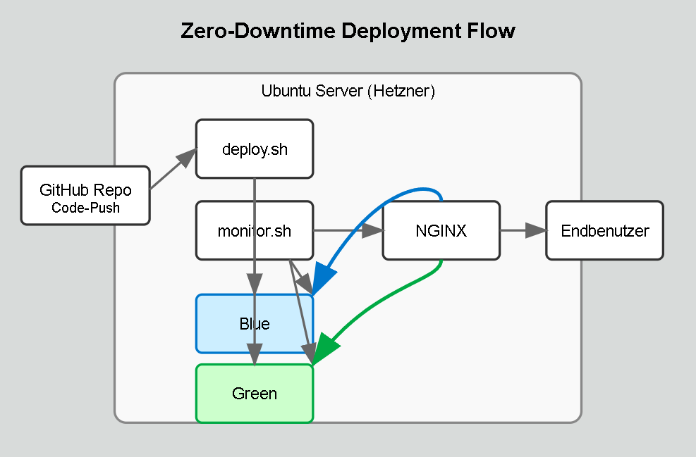

# Zero-Downtime Deployment eines Rust-basierten Blockchain-Indexers

  

Dieses Projekt implementiert ein Zero-Downtime Deployment-System für  Penumbra Blockchain Explorer, der kryptographische Blockchain-Daten für Endbenutzer verständlich visualisiert. [Penumbra](https://penumbra.zone/) ist eine datenschutzorientierte Zero-Knowledge-Blockchain, deren komplexe Datenstrukturen ohne spezielle Indexierung und Aufbereitung für normale Anwender nicht lesbar wären.

## Wichtige Links

| Beschreibung | Link |
|--------------|------|
| **Doku-Repository** | [tbz-zerodowntime-deployment-project](https://github.com/JumpiiX/tbz-zerodowntime-deployment-project) |
| **Rust Blockchain Indexer** | [penumbra-explorer-backend](https://github.com/pk-labs/penumbra-explorer-backend) |
| **Scrum Board** | [GitHub Projects Board](https://github.com/users/JumpiiX/projects/2/views/1) |
| **Roadmap** | [Projekt Roadmap](https://github.com/users/JumpiiX/projects/2/views/4) |
| **Sprints** | [Milestones Übersicht](https://github.com/JumpiiX/tbz-zerodowntime-deployment-project/milestones) |

## Inhaltsverzeichnis

1. [Einführung und Problemstellung](#einführung-und-problemstellung)
2. [Projektziele](#projektziele)
3. [Projektmanagement](#projektmanagement)
4. [Sprints und Fortschritt](#sprints-und-fortschritt)
5. [Technische Dokumentation](#technische-dokumentation)
6. [Risiken](#risiken)

## Einführung und Problemstellung

### Problemstellung

Blockchain-Daten müssen kontinuierlich und zuverlässig indiziert werden, um sie in Echtzeit für Endanwender bereitzustellen – beispielsweise in einem Block Explorer. Da sich das Datenmodell oder die Indizierungslogik regelmässig ändert, müssen bestehende Indexer-Instanzen ersetzt und Daten neu aufgebaut werden (Reindexing).

Ohne geeignete Strategie führt dies zu:
- **Downtime** für Endnutzer
- **Inkonsistenten Daten** während der Umschaltung
- **Benutzerfehlern** durch unvollständige Daten

### Für wen lösen wir das Problem?

Mein aktueller Arbeitgeber [PK Labs](https://www.pklabs.me/) benötigt eine Lösung, um unsere Rust-basierten Blockchain-Indexer für die Penumbra-Blockchain ohne Unterbrechungen aktualisieren zu können. Dies betrifft sowohl:
- Interne Entwicklungsteams, die kontinuierlichen Zugriff auf Blockchain-Daten benötigen
- Externe Kunden und Nutzer, die auf die API des Indexers für ihre Anwendungen angewiesen sind
- Unseren [Penumbra Blockchain Explorer](https://explorer.penumbra.zone/) 

### Herausforderungen bei aktuellen Deployments

Die bestehenden Deployment-Prozesse bei PK Labs haben folgende Herausforderungen:

| Herausforderung | Auswirkung | Häufigkeit |
|-----------------|------------|------------|
| Downtime während Updates | Nutzer können nicht auf den Explorer zugreifen | Bei jedem Update (ca. 2x pro Woche) |
| Inkonsistente Daten | Falsche oder unvollständige Informationen werden angezeigt | Bei jedem Reindexing-Vorgang |
| Manuelle Überwachung | Entwickler müssen den Synchronisationsprozess überwachen | Dauerhaft während Updates |
| Kein automatischer Rollback | Bei Fehlern ist manuelles Eingreifen erforderlich | Bei ca. 15% der Deployments |

### Lösungsansatz: Blue-Green Deployment

Die Lösung für die genannten Herausforderungen ist ein **Blue-Green Deployment**-Konzept:

1. **Parallel-Betrieb:** Eine neue Indexer-Instanz (Green) wird parallel zur laufenden Instanz (Blue) gestartet
2. **Hintergrund-Synchronisation:** Die neue Instanz synchronisiert die Blockchain-Daten, während die alte weiter im Produktivbetrieb ist
3. **Automatische Erkennung:** Ein Monitoring-System erkennt, wann die neue Instanz vollständig synchronisiert ist
4. **Nahtlose Umschaltung:** Ein NGINX Reverse Proxy leitet den Traffic ohne Unterbrechung zur neuen Instanz um
5. **Fallback-Option:** Bei Problemen kann sofort zur alten Instanz zurückgeschaltet werden

#### Komponenten der Lösung

| Komponente | Zweck | Technologie |
|------------|-------|-------------|
| **NGINX Reverse Proxy** | Traffic-Steuerung zwischen Umgebungen | NGINX mit dynamischer Konfiguration |
| **Docker Container** | Isolierte Umgebungen für den Indexer | Docker, Docker Compose |
| **Monitoring-Script** | Überwachung des Synchronisationsstatus | Shell-Script mit Docker-Abfragen |
| **Switch-Mechanismus** | Automatisierte Umschaltung | Shell-Script zur NGINX-Konfiguration |
| **Rollback-Mechanismus** | Sichere Rückkehr zur vorherigen Version | Automatisiertes Script mit Datenbank-Checks |

#### Visualisierung

*Abbildung: Visualisierung des Zero-Downtime Deployment-Prozesses mit Blue-Green Strategie vom Code-Push bis zum Traffic-Switch*

## Projektziele

Die Ziele dieses Projekts sind nach dem SMART-Prinzip definiert:

### 1. Eliminierung von Deployment-bedingten Downtimes
- **Spezifisch:** Implementierung eines Blue-Green Deployment-Systems, das Updates ohne Ausfallzeit ermöglicht
- **Messbar:** Reduzierung der Downtime von derzeit durchschnittlich 15 Minuten pro Deployment auf 0 Sekunden
- **Attraktiv:** Erhöhte Verfügbarkeit des Blockchain-Explorers (Ziel: 99,9%)
- **Realistisch:** Umsetzbar mit NGINX, Docker und automatisierten Scripts
- **Terminiert:** Vollständig implementiert bis 09.07.2025

### 2. Automatisierung der Deployment-Pipeline
- **Spezifisch:** Entwicklung einer vollautomatischen Deployment-Pipeline vom Code bis zur Produktion
- **Messbar:** Reduzierung des manuellen Aufwands pro Deployment von 45 auf unter 5 Minuten
- **Attraktiv:** Geringere Fehleranfälligkeit und höhere Entwicklereffizienz
- **Realistisch:** Umsetzbar mit Shell-Scripts und Docker Compose
- **Terminiert:** Fertigstellung bis Ende Sprint 2 (02.06.2025)

### 3. Implementierung einer zuverlässigen Synchronisationserkennung
- **Spezifisch:** Entwicklung eines Monitoring-Systems zur Erkennung des Indexer-Synchronisationsstatus
- **Messbar:** 100% zuverlässige Erkennung mit einer Fehlertoleranz von maximal 0,1%
- **Attraktiv:** Vermeidung von Dateninkonsistenzen und falschen Umschaltungen
- **Realistisch:** Implementierbar mit API-Abfragen und intelligenten Vergleichsalgorithmen
- **Terminiert:** Abschluss bis Mitte Sprint 3 (15.06.2025)

## Projektmanagement

### Agile Arbeitsweise mit Scrum

Für dieses Projekt wird **Scrum** als agile Methodik verwendet aus folgenden Gründen:

1. **Iterative Entwicklung:** Die komplexe Natur des Blue-Green Deployments erfordert einen schrittweisen Ansatz, bei dem Komponenten einzeln entwickelt und getestet werden können.

2. **Regelmässiges Feedback:** Durch Sprint Reviews mit den Dozenten kann frühzeitig wertvolles Feedback eingeholt und in die weitere Entwicklung einbezogen werden.

3. **Transparente Fortschrittsverfolgung:** Das Scrum-Board bietet jederzeit einen klaren Überblick über den aktuellen Projektstand und offene Tasks.

4. **Flexibilität:** Neue Erkenntnisse oder sich ändernde Anforderungen können schnell in die Projektplanung integriert werden.

#### Anpassungen für Einzelprojekt

Da es sich um ein Einzelprojekt handelt, wurden folgende Anpassungen am klassischen Scrum-Prozess vorgenommen:

| Scrum-Element | Klassische Umsetzung | Anpassung für Einzelprojekt |
|---------------|----------------------|----------------------------|
| **Daily Standup** | Tägliches Team-Meeting | Tägliche Selbstreflexion und Fortschrittsdokumentation |
| **Sprint Planning** | Team-Entscheidung | Abstimmung mit Dozenten und eigenständige Planung |
| **Peer Reviews** | Team-interne Reviews | Dozentenfeedback und Selbstreview anhand von Checklisten |
| **Product Owner** | Dedizierte Rolle | Rolle wird durch Dozenten und selbst übernommen |
| **Scrum Master** | Dedizierte Rolle | Selbstorganisation mit regelmäßiger Prozessreflexion |

### Definition of Done

Ein Task gilt als abgeschlossen, wenn:

1. Die Implementierung vollständig ist und alle Akzeptanzkriterien erfüllt sind
2. Eine umfassende Dokumentation erstellt wurde, die für neue Mitarbeiter verständlich ist
3. Tests durchgeführt und dokumentiert wurden (mit Testprotokoll)
4. Der Code/die Änderung ist ins Repository eingecheckt
5. Falls möglich, hat ein Peer-Review (durch Dozenten oder Kollegen) stattgefunden

---

  

*Dieses Projekt wird im Rahmen der TBZ Semesterarbeit für PK Labs umgesetzt.*

*Letzte Aktualisierung: 05.05.2025*
